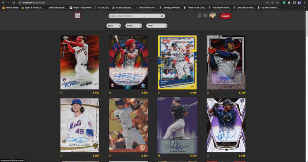
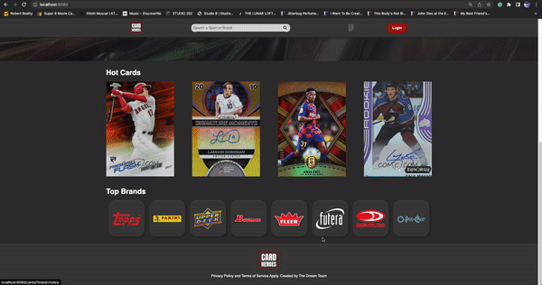
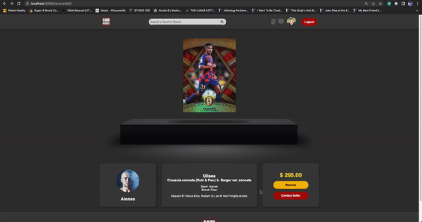
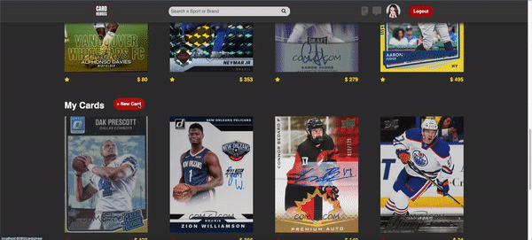
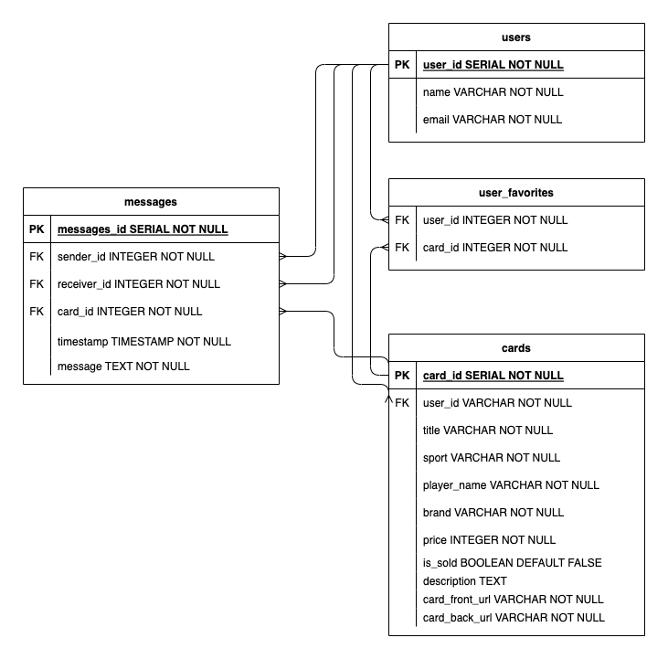

# Card Heroes Midterm Project

Card Heroes is a project as part of Lighthouse Labs midterms.
Out of 10 projects, Card Heroes is based on option #8 which is a Buy/Sell website.


Card Heroes is the ultimate destination for trading card enthusiasts. With over a million cards to choose from, we have the perfect card for every collector. Whether you’re looking for the rarest of cards or just need a few to start your collection, Card Heroes has it all. Our online store offers a secure and safe shopping experience. Let Card Heroes be your heroes of the trading card world!


## Authors

- [@Ruheee](https://github.com/Ruheee)
- [@pedrolorandi](https://github.com/pedrolorandi)
- [@davique0](https://github.com/davique0)


## Demo

### Home Page


### Admin/User Page


### Filtering



### Card ID and Contact Seller



### Add to Favorites



### Add New Card



### Delete Card


## Deployment

To deploy this project run

```bash
  npm run local
```


## Run Locally

Clone the project

```bash
  git clone https://github.com/Ruheee/CardHeros
```

Go to the project directory

```bash
  cd CardHeros
```

Install dependencies

```bash
  npm install
```

Start the server

```bash
  npm run local
```
On browser

```bash
localhost:8080
```


## Tech Stack

**Client:** HTML, CSS, JS, EJS, SASS

**Server:** Node, Express, Postgesql 


## Dependencies

- Node 10.x or above
- NPM 5.x or above
- PG 6.x


## Database

run node psql

```bash
psql
```

run schema 

```bash
\i db/schema/01_schema.sql
```

add seeds

```bash
\i db/seeds/01_users.sql

\i db/seeds/02_cards.sql

\i db/seeds/03_messages.sql

\i db/seeds/04_favourites.sql
```

### schema

)
